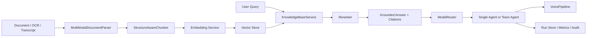

# Legal Agentic Knowledge Platform


A Python backend project that turns legal and enterprise documents into a grounded, auditable, agent-driven knowledge service.

This repository focuses on the parts that usually separate a portfolio demo from a production-aware backend:

- long-document parsing and structure-aware ingestion
- grounded RAG with citations and refusal control
- model routing with retry, rate limiting, circuit breaking, and fallback
- single-agent and multi-agent execution loops
- audit logs, evaluation, metrics, and service-facing APIs

## What This Project Covers

This platform is designed around a legal knowledge assistant scenario:

- ingest legal documents, OCR text, and transcripts into a searchable knowledge base
- answer questions with explicit citations instead of free-form generation
- refuse or downgrade answers when evidence is weak
- route tasks across different model clients and execution paths
- expose the workflow as a FastAPI service with audit and ops endpoints

## Why It Is Interesting

Most public RAG demos stop at "upload a file and chat with it." This project goes further:

- keeps document structure and metadata through ingestion
- separates retrieval, reranking, answer synthesis, and narration
- supports both a single-agent flow and a reviewer-backed team-agent flow
- records runs for replay, inspection, and evaluation
- includes observability endpoints and a CI workflow

## Architecture



## Capability Snapshot

| Area | What is implemented |
| --- | --- |
| Document understanding | Markdown parsing, OCR/transcript normalization, structure-aware metadata |
| RAG | chunking, embeddings, vector search, rerank, grounded answers with citations |
| Safety and quality | question typing, refusal control, confidence-aware fallback |
| Model orchestration | task routing, retry, rate limiting, circuit breaker, fallback |
| Agents | ReAct-style flow, single-agent mode, team-agent mode with reviewer |
| Service layer | FastAPI app, API key guard, health and ops endpoints |
| Observability | request IDs, structured logs, metrics, run audit records |
| Evaluation | offline evaluation scripts and imported legal benchmark assets |

## Legal Benchmark Snapshot

The repository includes historical offline benchmark assets imported from the earlier legal-domain project. These numbers are presented as evaluation snapshots, not as online production metrics:

| Metric | Snapshot |
| --- | --- |
| Dense retrieval recall@3 / recall@5 | 92.5% - 95% |
| Answer correctness | 100% |
| Citation correctness | 100% |
| Refusal appropriateness | 100% |
| Hallucination rate | 0% |

## Current Milestone

- `v0.1.0`: first public portfolio release for the legal agentic knowledge platform
- includes grounded RAG, legal query policy, single-agent and team-agent workflows, evaluation, observability, CI, and Docker assets

## Runtime Modes

The project supports two practical modes:

### 1. Offline demo mode

Useful for local walkthroughs and interviews.

- standard-library-first core flow
- local hashing embeddings
- in-memory vector search
- stub voice pipeline

### 2. Service-backed mode

Useful for showing how the same architecture can switch to external services.

- OpenAI-compatible model and embedding adapters
- Qdrant REST vector store adapter
- Docker and compose files for service-style startup

## Agent Flows

### Single agent

```text
retrieve -> answer with citations -> voice narration
```

### Team agent

```text
react-agent -> review-agent -> narration-agent
```

The team flow is meant to demonstrate a more realistic quality gate:

- the react agent retrieves evidence and drafts the answer
- the review agent checks grounding and citation sufficiency
- the narration agent turns the result into a delivery-friendly explanation

## Quickstart

### Run the local demos

```bash
python scripts/demo_cli.py
python scripts/demo_showcase.py
python scripts/run_eval.py
```

### Run tests

```bash
python -m unittest discover -s tests -v
```

### Install and start the API

```bash
pip install -e .
uvicorn agentic_knowledge_platform.main:create_app --factory --reload
```

### Start with Docker

```bash
docker compose up --build
```

## API Surface

Core endpoints exposed by the service:

- `GET /health`
- `GET /ops/overview`
- `GET /metrics`
- `GET /documents`
- `POST /documents/ingest`
- `POST /rag/query`
- `POST /agent/run`
- `POST /agent/team/run`
- `POST /voice/narrate`
- `POST /workflow/demo`
- `GET /runs`
- `POST /evals/run`

`/health` reports which backend adapters are active. `/ops/overview` exposes recent request and pipeline summaries. `/metrics` exports Prometheus-style metrics text.

## Example Service Configuration

```env
MODEL_PROVIDER=openai_compatible
MODEL_ENDPOINT_MODE=responses
MODEL_BASE_URL=https://api.openai.com
MODEL_API_KEY=your_key

EMBEDDING_PROVIDER=openai_compatible
EMBEDDING_BASE_URL=https://api.openai.com
EMBEDDING_API_KEY=your_key
EMBEDDING_MODEL_NAME=text-embedding-3-small

VECTOR_STORE_BACKEND=qdrant
QDRANT_URL=http://qdrant:6333
QDRANT_COLLECTION_NAME=knowledge_chunks
```

## Repository Layout

```text
.
├─ examples/
│  ├─ employee_handbook.md
│  └─ legal/
├─ scripts/
│  ├─ demo_cli.py
│  ├─ demo_showcase.py
│  └─ run_eval.py
├─ src/agentic_knowledge_platform/
│  ├─ agents/
│  ├─ core/
│  ├─ services/
│  ├─ workflows/
│  ├─ container.py
│  └─ main.py
├─ tests/
└─ docs/
```

## Technical Notes

- retrieval can be isolated by `tenant_id`
- run records can stay in memory for demos or move to SQLite for persistence
- voice generation is abstracted behind a pipeline interface so TTS or avatar systems can be swapped in later
- the legal query policy adds question typing, conservative refusal, and confidence-aware answer shaping

## Additional Documentation

- `CHANGELOG.md`
- `docs/DEPLOYMENT.md`
- `docs/LEGAL_CASE_STUDY.md`
- `docs/PROJECT_WALKTHROUGH_ZH.md`

## Intended Use

This repository is intended as a serious backend portfolio project for AI application engineering roles, especially positions involving:

- RAG and knowledge systems
- agent orchestration
- FastAPI backend services
- evaluation and observability
- legal or document-heavy AI workflows
