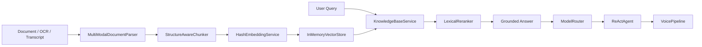

# Agentic Knowledge Platform

一个为求职作品集设计的 Python 后端 Demo，目标是把岗位 JD 里的五条能力链路做成一套能讲清楚、能扩展、能现场演示的工程化项目：

- 长文档解析与知识入库
- RAG 服务化与严格引用
- 多模型 API 编排
- ReAct 风格 Agent 工作流
- TTS / VoiceClone / A2F 语音链路抽象

## 为什么这个项目适合拿去面试讲

这个项目不是“聊天机器人壳子”，而是从文档理解、检索、回答、引用、语音讲解一路打通的后端服务骨架。它把真正的工程问题拆成了可替换组件：

- `Parser` 负责把 Markdown / OCR 文本 / 会议转写统一成结构化元素。
- `Chunker + Embeddings + VectorStore + Reranker` 组成可演示的 RAG 主链路。
- `ModelRouter` 负责任务路由、限流、熔断、fallback。
- `ReActAgent` 把检索、生成、语音讲解串起来，并保留审计轨迹。
- `VoicePipeline` 对接 TTS / A2F 一类接口时，只需要补适配器即可。

## 架构图



## 目录结构

```text
.
├─ examples/
│  └─ employee_handbook.md
├─ scripts/
│  └─ demo_cli.py
├─ src/
│  └─ agentic_knowledge_platform/
│     ├─ agents/
│     ├─ core/
│     ├─ services/
│     ├─ workflows/
│     ├─ container.py
│     ├─ main.py
│     ├─ text.py
│     └─ types.py
└─ tests/
```

## 功能亮点

### 1. 文档解析与入库

- 支持 Markdown 标题、段落、列表、表格、公式块解析。
- 提供 OCR 文本和音频转写的统一归一化入口。
- 输出结构化元素时保留 `document_id / section / source / modality` 元数据，便于后续溯源。

### 2. RAG 服务化

- 按章节优先切块，并保留 overlap。
- 使用离线可运行的哈希 Embedding，方便本地 Demo 演示。
- 检索链路是 `embedding -> vector search -> rerank -> grounded answer`。
- 当 top hit 置信度不足时，会明确返回“证据不足”，而不是编造答案。
- 支持按 `tenant_id` 做检索隔离，便于演示多租户知识库。

### 3. 模型编排

- 为 `summary / qa / speech_script` 三类任务配置独立路由。
- 带滑动窗口限流、熔断、重试、fallback。
- 接入外部模型时，只需新增 `ModelClient` 适配器。

### 4. Agent 工作流

- 使用 ReAct 风格步骤：`knowledge_retrieve -> answer_with_citations -> voice_narration`。
- 每一步都记录 `thought / action / observation`，可用于调试、日志和审计。
- 可进一步扩展为多 Agent 场景，例如“检索 Agent + 审核 Agent + 讲解 Agent”。

### 4.1 多 Agent 协作

- 额外提供团队模式：`react-agent -> review-agent -> narration-agent`。
- `review-agent` 会在回答输出前检查 grounded 状态和 citation 数量。
- 所有运行都会写入审计仓，可用内存模式做 Demo，也可切到 SQLite 持久化。

### 4.2 评测与审计

- 支持把 Agent 运行记录写入 SQLite，便于持久化审计与回放。
- 提供离线评测脚本与样例数据集，可输出 grounded rate、citation coverage、pass rate、平均延迟。
- 支持基础 API Key 鉴权，避免把 Demo 直接暴露成完全裸接口。

### 5. 语音链路

- `VoicePipeline` 把 TTS、A2F 渲染抽象为独立组件。
- 现在提供离线 Stub，后续替换成阿里云、Azure、科大讯飞或 NVIDIA A2F 时不改业务编排层。

## 如何运行

### 先跑离线 CLI Demo

当前仓库的核心逻辑只依赖标准库，可以直接运行：

```bash
python scripts/demo_cli.py
python scripts/demo_showcase.py
python scripts/run_eval.py
```

### 运行单元测试

```bash
python -m unittest discover -s tests -v
```

### 启动 FastAPI 服务

当前环境未安装依赖，所以这里是项目交付说明。装好依赖后即可运行：

```bash
pip install -e .
uvicorn agentic_knowledge_platform.main:create_app --factory --reload
```

### Docker 启动

仓库已经补了 `Dockerfile` 和 `docker-compose.yml`，可以直接启动 API 和 Qdrant：

```bash
docker compose up --build
```

## 关键 API

- `GET /health`
- `GET /ops/overview`
- `GET /metrics`
- `GET /documents`
- `POST /documents/ingest`
- `POST /rag/query`
- `POST /agent/run`
- `POST /agent/team/run`
- `POST /voice/narrate`
- `POST /workflow/demo`
- `GET /runs`
- `POST /evals/run`

`/health` 会显示当前使用的是哪种模型、Embedding 和向量库后端，方便演示“离线模式”和“真实服务模式”的切换。
`/ops/overview` 会返回最近请求、路由级延迟和 pipeline 级 grounded/citation 统计，`/metrics` 则提供 Prometheus 风格指标输出，便于演示服务可观测性。

## 真实适配层

在默认离线模式之外，仓库已经补好了两类可替换适配层：

- OpenAI-compatible 模型客户端：可对接 OpenAI、DeepSeek、Qwen 一类兼容 HTTP 接口的模型网关；
- Qdrant REST 向量库适配器：可把当前的内存向量检索切换成独立向量服务。

推荐的环境变量组合：

```env
MODEL_PROVIDER=openai_compatible
MODEL_ENDPOINT_MODE=responses
MODEL_BASE_URL=https://api.openai.com
MODEL_API_KEY=your_key

EMBEDDING_PROVIDER=openai_compatible
EMBEDDING_BASE_URL=https://api.openai.com
EMBEDDING_API_KEY=your_key
EMBEDDING_MODEL_NAME=text-embedding-3-small

VECTOR_STORE_BACKEND=qdrant
QDRANT_URL=http://qdrant:6333
QDRANT_COLLECTION_NAME=knowledge_chunks
```

更具体的部署说明见：

- `docs/DEPLOYMENT.md`
- `docs/LEGAL_CASE_STUDY.md`
- `docs/PROJECT_FINALIZATION.md`
- `docs/GITHUB_PUBLISHING.md`
- `docs/RESUME_BULLETS.md`
- `docs/RESUME_REWRITE_ZH.md`
- `docs/WEI_XIANG_RESUME_FINAL_ZH.md`
- `docs/INTERVIEW_GUIDE.md`
- `docs/INTERVIEW_SCRIPT_ZH.md`

## 推荐面试讲法

你可以按下面这条故事线讲：

1. 先讲业务目标：把企业文档、OCR、转写统一成知识库。
2. 再讲 RAG 主链路：结构化解析、切块、Embedding、检索、重排、引用控制。
3. 然后讲模型编排：不同任务走不同模型，并有 fallback 与熔断。
4. 最后讲 Agent 和语音：把“检索 -> 回答 -> 语音讲解”串成可监控流程。

## 下一步可扩展方向

- 接入真实向量库：Milvus / Qdrant / FAISS / LanceDB
- 接入真实大模型：OpenAI / DeepSeek / Qwen / Claude
- 接入真实 OCR / ASR：PaddleOCR / Whisper / 云厂商 ASR
- 增加日志、Tracing、指标上报、任务队列和权限控制
- 增加多租户、知识库版本管理、离线批量入库流程
